# 🪒 Shaving Him (shaving_him) v1.14.0

<div align="center">

[](https://clarusiubar.github.io/shaving_him/)
[](https://github.com/ClarusIubar/shaving_him)
[](https://github.com/ClarusIubar/shaving_him)
[](https://github.com/ClarusIubar/shaving_him)
[](https://opensource.org/licenses/MIT)

**1-Photo Client-Side ASCII Shaving Engine** with 5-Layer Clean Architecture, SOLID DI & Web Audio Synthesis.  
**[👉 🌐 라이브 웹 애플리케이션 실행 (Live Game Play)](https://clarusiubar.github.io/shaving_him/)**

</div>

---

## 📌 Overview (개요)

`shaving_him`은 단일 입력 사진을 브라우저 런타임(Canvas 2D) 내에서 분석하여 **피부 톤 평탄화, 수염 비트맵 차분 분리, 아스키 글리프 매핑** 파이프라인을 거친 후, 마우스/터치 인터랙션을 통해 면도(Shaving) 처리를 수행하는 클라이언트 사이드 웹 애플리케이션입니다.

외부 런타임 이미지/오디오 파일 의존성 0바이트(0B Asset Load), Web Audio API 절차적 음향 합성, 1D `Uint8Array` 기반 비트맵 메모리 구조, 8-연결 브레젠험 선분 래스터라이저, 5계층 클린 아키텍처 및 RGR TDD 개발 방법론을 기반으로 구성되었습니다.

---

## ✨ Key Features (주요 기능)

1. **📷 1-Photo 인브라우저 아스키 스테이지 생성**:
   - `PNG`, `JPG`, `WEBP` 포맷 지원.
   - 외부 서버 전송 없이 브라우저 메모리 상에서 100ms 이내에 피부 영역과 수염 마스크를 분리하여 아스키 스테이지 생성.
2. **🎮 내장 아스키 프리셋 스테이지**:
   - 기본 제공 아스키 데이터(`game_data.json`, `game_data.js`) 로딩 지원.
3. **🪒 60fps GPU 가속 면도 조작계**:
   - 면도날 반경 제어 (`1~4` 키보드 단축키, UI 버튼, 마우스 휠 스크롤 지원).
   - 마우스 드래그 및 모바일 터치 이벤트 수신 지원.
   - GPU 컴포지팅 `translate3d` 및 캐싱을 통한 Layout Reflow 방지.
4. **🔊 Web Audio API 절차적 실시간 음향 합성 (0B Asset Dependency)**:
   - **면도 마찰음**: 50ms 대역통과 필터(2200Hz) 화이트 노이즈.
   - **콤보 사운드**: C5(523Hz) 기준 연속 콤보에 따른 가변 피치 시프트 사인파 합성.
   - **승리 사운드**: C5 - E5 - G5 - C6 트라이앵글 4중 화음.
5. **✨ 파티클 물리 시뮬레이션 (`ParticleSystem`)**:
   - 면도된 수염 글리프의 중력 및 무작위 속도 기반 비산 애니메이션.
6. **📊 HUD & 통계 모니터링**:
   - 60초 제한시간 타이머, 실시간 점수, 잔여 수염 개수, 진행률 게이지, 결과 오버레이 및 PNG 캡처 내보내기.

---

## 🏛️ 5-Layer Clean Architecture & SOLID Design

```mermaid
graph TD
    subgraph "5. Presentation Layer (src/ui/)"
        IM[InputManager] --> BC[BrushController]
        BC --> CV[CursorView]
        IM --> HUD[HUD Facade]
        HUD --> SV[StatsHUDView]
        HUD --> SM[StageSelectModalView]
        HUD --> LO[LoadingOverlayView]
        HUD --> GO[GameOverOverlayView]
        CR[CanvasRenderer] --> PS[ParticleSystem]
        SE[SoundEffects]
    end

    subgraph "3. Application Layer (src/app/)"
        GO2[GameOrchestrator] --> SP[StagePipeline]
        GO2 --> CRoot[CompositionRoot]
    end

    subgraph "2. Ports Layer (src/ports/)"
        P1[StageSourcePort]
        P2[ImageProcessorPort]
        P3[AsciiConverterPort]
        P4[DiffEnginePort]
    end

    subgraph "4. Adapters Layer (src/adapters/)"
        A1[StaticJsonStageAdapter] -.-> P1
        A2[CanvasImageProcessorAdapter] -.-> P2
        A3[CanvasAsciiConverterAdapter] -.-> P3
        A4[DeltaDiffEngineAdapter] -.-> P4
        A2 --> IFL[ImageFileLoader]
    end

    subgraph "1. Pure Domain Layer (src/domain/)"
        HG[HairGrid]
        SS[ShaveSession]
        ST[SessionTimer]
        SC[ScoreCalculator] --> ISS[IScoringStrategy]
        GG[GridGeometry]
        LR[LineRasterizer]
        SV2[SchemaValidator]
        GP[GamePolicy]
    end

    IM --> GO2
    GO2 --> SS
    GO2 --> ST
    SS --> HG
    SS --> SC
    SP --> P1
    SP --> P2
    SP --> P3
    SP --> P4
```



### 💎 SOLID 객체지향 5대 원칙 준수
- **SRP (단일 책임 원칙)**: `BrushController`에서 DOM 조작을 전담하는 `CursorView` 분리, 비동기 디코딩 전담 `ImageFileLoader` 분리.
- **OCP (개방 폐쇄 원칙)**: `ScoreCalculator`의 `IScoringStrategy` 인터페이스를 통한 점수 계산 정책 분리 및 주입.
- **LSP (리스코프 치환 원칙)**: 모든 어댑터가 추상 Port를 상속하고 표준 시그니처 계약을 충족.
- **ISP (인터페이스 분리 원칙)**: `InputManager`가 세분화된 `statsView`/`modalView`를 직접 주입받을 수 있도록 의존성 분리.
- **DIP (의존성 역전 원칙)**: `CompositionRoot` 및 생성자 의존성 주입(DI) 배선 표준화.

---

## 📊 Quality & Performance Metrics (품질 지표)

| 지표 항목 | 실측 수치 | 엔지니어링 의의 |
| :--- | :---: | :--- |
| **Line Coverage** | **100.00%** | 소스 코드 전 라인 실행 검증 |
| **Function Coverage** | **100.00%** | 전 함수 및 메서드 계약 검증 |
| **Branch Coverage** | **99.05%** | 조건식 및 에러 분기 검증 |
| **Ternary Operators** | **0건 (Zero-Ternary)** | 삼항 연산자 미사용으로 명시적 분기 흐름 유지 |
| **Cyclomatic Complexity** | **$CC \le 3\sim 4$** | 선언적 룩업 매핑(`OPACITY_MAP`, `STAGE_EXTENSIONS`) 및 단일 리졸버 적용 |
| **Automated Tests** | **150 / 150 PASS** | Node.js 네이티브 테스트 러너 기반 (실행 시간 < 0.4초) |
| **Console Noise** | **Zero Noise** | 테스트 및 런타임 실행 시 콘솔 경고/에러/Unhandled Rejection 0건 |
| **Memory Allocation** | **0B during Shave** | 1D `Uint8Array` 비트맵 적용으로 런타임 GC 오버헤드 억제 |

---

## 🚀 Local Running (로컬 실행 방법)

별도의 백엔드 웹서버나 빌드 도구 없이 브라우저에서 바로 실행할 수 있습니다.

1. **저장소 클론**:
   ```bash
   git clone https://github.com/ClarusIubar/shaving_him.git
   cd shaving_him
   ```
2. **브라우저로 직접 열기**:
   - `index.html` 파일을 더블클릭(`file:///...`)하거나 로컬 정적 서버로 실행합니다:
   ```bash
   npx serve .
   ```

---

## 🧪 Testing & Coverage (테스트 실행)

Node.js 내장 테스트 러너(`node --test`)와 C8 커버리지 게이트를 실행합니다:

```bash
# 단위 / 통합 / E2E / 퍼징 전체 150개 테스트 실행
npm test

# 100% Line, 100% Func, >=90% Branch 커버리지 게이트 검증
npm run coverage
```

---

## 📚 Documentation & Wiki (기술 지식 위키)

자세한 시스템 설계서 및 아키텍처 의사결정록(ADR)은 [GitHub Wiki](https://github.com/ClarusIubar/shaving_him/wiki)에서 확인할 수 있습니다:

- [🏠 Wiki 홈](https://github.com/ClarusIubar/shaving_him/wiki/Home)
- [📁 시스템 설계서](https://github.com/ClarusIubar/shaving_him/wiki/설계서)
- [🏛️ 아키텍처 결정록 (ADR)](https://github.com/ClarusIubar/shaving_him/wiki/ADR)
- [📂 소스모듈 명세서](https://github.com/ClarusIubar/shaving_him/wiki/프로젝트_디렉토리_및_모듈_구조_명세서)
- [🧪 테스트 체계 및 TDD 명세서](https://github.com/ClarusIubar/shaving_him/wiki/테스트_체계_및_TDD_명세서)
- [📜 변경 이력 (CHANGELOG)](https://github.com/ClarusIubar/shaving_him/wiki/CHANGELOG)

---

## 📄 License

MIT License © 2026 ClarusIubar
