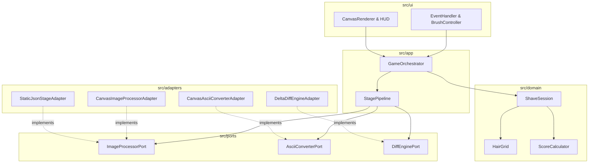
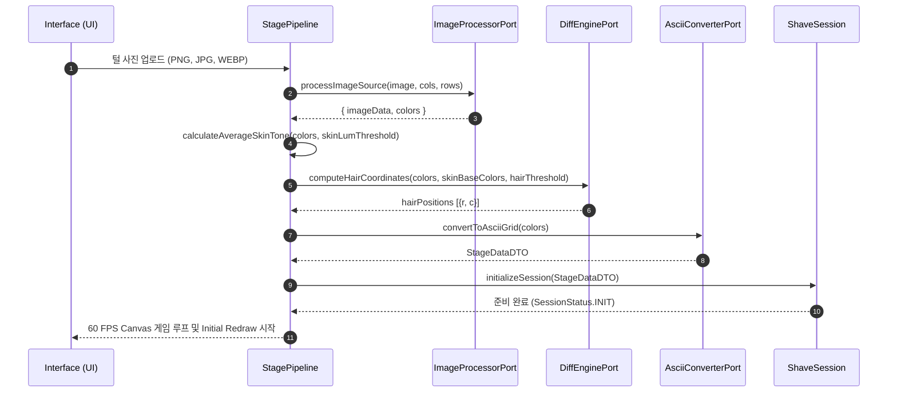

# 🏛️ 아키텍처 명세서 (Architecture Specification): `shaving_him`

> **문서 상태**: 승인된 아키텍처 명세서 (Approved Architecture Specification)  
> **거버넌스 권한**: `C:/Users/PC/.agent-governance` & `architecture-spec-writer`  
> **저장소**: `ClarusIubar/shaving_him`  
> **대상 버전**: `v1.0.1-refactored`  

---

## 1. 개요 및 시스템 목표 (Overview & System Goals)

`shaving_him`은 사용자가 캔버스 위의 캐릭터 털을 면도날 커서로 마우스/터치 드래그하여 제거하고 점수를 획득하는 웹 기반 면도 게임입니다.

### 문제 정의 (Problem Statement)
과거 단일 모놀리식 스크립트 기반 구현 방식은 정적 파일(`before.html`, `after.html`) 및 대용량 사전 계산 데이터 (`game_data.json`, 1.8MB)에 의존했습니다. 새로운 스테이지 작성을 위해서는 외부 툴이 필요했고, 면도날 크기가 3x3 셀로 고정되어 터치 드래그나 dynamic resizing 조작을 지원하지 못했습니다.

### 시스템 목표 (System Objectives)
1. **1-Photo 브라우저 실시간 파이프라인**: 털 사진 1장을 입력받아 동적 평균 피부 톤 계산, 털 차이 좌표 추출, 아스키(ASCII) 아트 스테이지를 브라우저 내에서 실시간(1초 이내) 생성합니다.
2. **순수 5계층 클린 아키텍처 (Clean 5-Layer Architecture)**: 게임 도메인 로직과 브라우저 DOM/Canvas API 간 결합도를 0%로 유지하여 완벽한 모듈화를 달성합니다.
3. **고성능 조작 UX 및 메모리 안전성**: 면도날 크기 동적 조작(3x3 ~ 15x15), 마우스/터치 드래그 지원, `URL.revokeObjectURL()`을 통한 메모리 누수 방지, 60 FPS Canvas 부분 렌더링을 제공합니다.

---

## 2. 계층별 모듈 맵 및 역할 정의 (Layered Module Map & Responsibilities)



### 계층별 역할 정의 마트릭스 (Layer Responsibility Matrix)

| 계층 (Layer) | 경로 (Path) | 주요 역할 및 책임 (Responsibilities) | 허용 의존성 | 금지 의존성 |
| --- | --- | --- | --- | --- |
| **Interface** | `src/ui/` | DOM 렌더링, Canvas 셀 그리기, HUD 상태 관리, 마우스/터치 이벤트, ObjectURL 생명주기 관리 | Application Layer DTOs | Core Domain 직접 변개, Adapters 내부 |
| **Application** | `src/app/` | 게임 루프 타이머 디스패치, 스테이지 원본 데이터(`currentStageData`) 보관, 파이프라인 파사드 실행 | Core Domain, Ports | Adapter 구현체 내부, 직접 DOM 조작 |
| **Core Domain** | `src/domain/` | 털 제거 비트맵 행렬 연산, 점수 및 콤보 획득 규칙, 세션 상태 머신 | Pure Value Objects | Browser DOM, Canvas APIs, Adapters |
| **Port** | `src/ports/` | 이미지 처리, 털 차이 계산, 아스키 아트 변환을 위한 추상 인터페이스 정의 | Domain & App DTOs | Concrete Adapter 구현체 |
| **Adapter** | `src/adapters/` | Canvas 2D 이미지 처리, 피부 톤 평탄화, 털 영역 좌표 추출, JSON 스테이지 로더 | Ports, Browser APIs | Core Domain 직접 상태 변경 |

---

## 3. 시퀀스 흐름 (1-Photo 실시간 파이프라인)



---

## 4. 60 FPS 성능 최적화 및 상태 머신 명세 (Performance & State Machine)

### 1) 1D `Uint8Array` 비트맵 및 Dirty Region 부분 렌더링
- **`HairGrid`**: 2차원 객체 배열 대신 1차원 `Uint8Array(rows * cols)` 메모리를 할당하여 $O(1)$ 속도로 털 존재 여부를 조회하고 0B 메모리 할당으로 GC 부하를 차단합니다.
- **Dirty Region Partial Redraw**: `CanvasRenderer`는 면도로 인해 변경된 국소 좌표(`dirtyCells`)만 `requestAnimationFrame` 프레임에 배치로 그려 1ms 미만의 렌더링 성능을 보장합니다.

### 2) 레이아웃 스래싱 방지 및 GPU 합성
- `BrushController`는 마우스 이동 시 `translate3d()`를 적용하여 브라우저 리플로우(Reflow)를 방지하며, `getBoundingClientRect()` 결과를 Resize/Scroll 이벤트 발생 시에만 캐싱 업데이트합니다.

### 3) 세션 상태 머신 (`ShaveSession`)
```text
INIT ──(start)──> RUNNING ──(shave all)──> WON
                     │
                 (timeout) ──> TIMEOUT
```

---

## 5. 모듈 간 상호작용 격리 규칙 (Component Interference Matrix)

| 소스 모듈 (Source) | 대상 모듈 (Target) | 규칙 (Rule) | 정당성 (Rationale) |
| --- | --- | --- | --- |
| `src/domain/*` | `src/adapters/*` | **금지 (Forbidden)** | 도메인 로직은 브라우저 Canvas API 없이 Node.js에서 100% 독립 테스트 가능해야 함 |
| `src/domain/*` | `window / document` | **금지 (Forbidden)** | 도메인은 순수 자바스크립트 로직이어야 함 |
| `src/ui/*` | `Core State Mutation` | **금지 (Forbidden)** | UI는 Application Orchestrator를 통해서만 단방향 명령어 전달 |
| `src/app/*` | `src/ports/*` | **허용 (Allowed)** | Orchestrator는 구현체(Adapter)가 아닌 추상 포트(Port)에만 의존함 |

---

## 6. 품질 및 검증 게이트 (Verification & Quality Gates)

1. **도메인 독립 테스트 게이트**: `src/domain/` 단위 테스트가 Node.js 내장 테스트 러너(`node --test`)로 100% 통과합니다.
2. **포트 교체 가능성 게이트**: 어댑터 구현체가 Port 인터페이스 규약을 준수하여 다형성 교체가 가능합니다.
3. **메모리 안전성 게이트**: 파일 선택 프리뷰 시 생성된 Blob URL이 `URL.revokeObjectURL()`을 통해 완전히 해제됩니다.
4. **CORS 프로토콜 폴백 게이트**: `file://` 프로토콜로 직접 구동 시 `EMBEDDED_GAME_DATA` 윈도우 객체를 통한 폴백 로딩을 지원합니다.

---

## 7. 최근 리팩토링 및 버그 수정 감사 내역 (v1.0.1 / v1.0.2 Audit)

| Task ID | 관련 이슈 | 발병 원인 (Root Cause) | 구현된 해결책 (Solution) | 검증 내역 (Verification) |
| --- | --- | --- | --- | --- |
| `TSK-001-01` | **[#10](https://github.com/ClarusIubar/shaving_him/issues/10)** | WON(올클리어) 후 `restart()` 시 이미 비워진 `hairGrid.data`를 참조하여 털이 0개로 시작됨 | `GameOrchestrator`에 `currentStageData`를 보관하고 리스타트 시 재사용 | `tests/app/app.test.js` 테스트 추가 통과 |
| `TSK-001-02` | **[#11](https://github.com/ClarusIubar/shaving_him/issues/11)** | 사진 반복 업로드 시 `URL.createObjectURL`로 생성된 Blob이 해제되지 않음 | `HUD` 내 `previewUrl` 상태를 관리하고 생성 전 `URL.revokeObjectURL()` 호출 | 수동 업로드 검증 및 테스팅 세션 통과 |
| `TSK-001-03` | **[#12](https://github.com/ClarusIubar/shaving_him/issues/12)** | Port 인터페이스의 메서드 파라미터가 Adapter 구현체와 불일치함 | `diff-engine.port.js` 및 `image-processor.port.js` 메서드 시그니처 표준화 | 어댑터 단위 테스트 통과 |
| `TSK-001-04` | **[#13](https://github.com/ClarusIubar/shaving_him/issues/13)** | 피부 톤 평탄화 시 RGB `[210, 180, 150]` 고정값 사용 | `StagePipeline`에 `calculateAverageSkinTone(colors)` 동적 샘플링 구현 | `tests/adapters/adapters.test.js` 테스트 통과 |
| `TSK-003-01` | **[#15](https://github.com/ClarusIubar/shaving_him/issues/15)** | 마우스 휠 조절 시 HUD 브러시 버튼 active 클래스가 갱신되지 않음 | `BrushController`에 `onRadiusChange` 콜백 구현 및 HUD 브러시 UI 동기화 | 단위 테스트 통과 (`app.test.js`) |
| `TSK-003-02` | **[#16](https://github.com/ClarusIubar/shaving_him/issues/16)** | 투명 PNG/WEBP 알파 채널 피셀(a=0)이 피부 톤 추출 시 어두운 털로 오인됨 | `StagePipeline` 내 `calculateAverageSkinTone` 및 Processor에 `a >= 128` 알파 체크 추가 | 단위 테스트 통과 (`adapters.test.js`) |
| `TSK-003-03` | **[#17](https://github.com/ClarusIubar/shaving_him/issues/17)** | `CanvasRenderer.renderSingleCell` 내 불필요한 `fillStyle` 재할당 병목 | 셀 백그라운드 Rect 채우기와 텍스트 `fillText` 렌더링 fillStyle 설정 분리 | 전체 수트 통과 (70ms) |
| `TSK-003-04` | **[#18](https://github.com/ClarusIubar/shaving_him/issues/18)** | 게임 종료(WON/TIMEOUT) 상태 후 드래그 시 `shave` 로직 불필요 진입 | `GameOrchestrator.shave` 상단에 `SessionStatus.RUNNING` 얼리 리턴 가드 추가 | 단위 테스트 통과 (`app.test.js`) |

