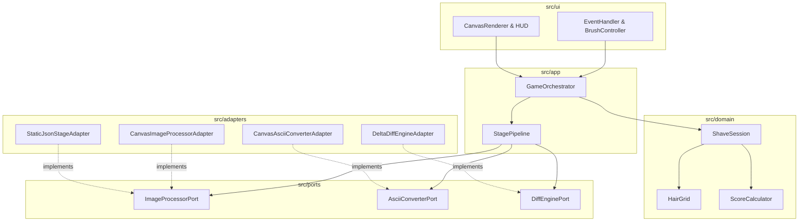
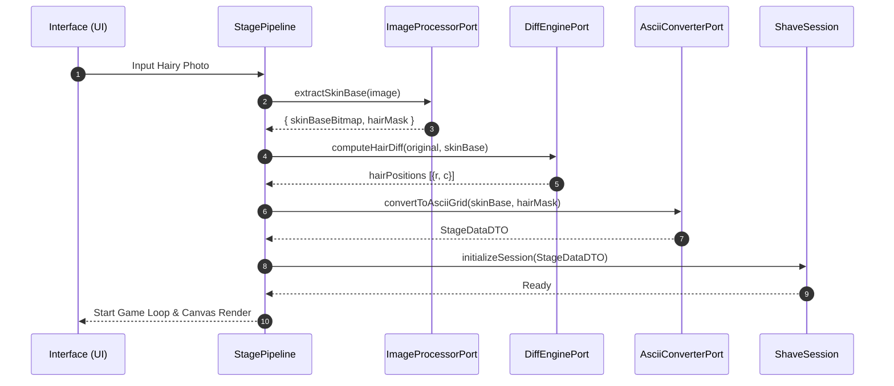

# Architecture Specification: `shaving_him`

> **Document Status**: Approved Architecture Specification  
> **Governance Authority**: `C:/Users/PC/.agent-governance` & `architecture-spec-writer`  
> **Repository**: `ClarusIubar/shaving_him`  
> **Target Version**: v1.0.0-modular  

---

## 1. Overview & System Goals

`shaving_him` is a web-based shaving game where players shave hair off a character canvas using a razor cursor to score points.

### Problem Statement
The legacy implementation was a single monolithic script (`index.html`) using static pre-rendered text files (`before.html`, `after.html`) and pre-calculated `game_data.json` (1.8MB). Creating new stages required manual external tooling, and the brush size was hardcoded to 3x3 cells without touch or drag support.

### System Objectives
1. **1-Photo In-Browser Pipeline**: Accept a single hairy photo, automatically extract the skin base, compute hair difference coordinates, and generate the ASCII game stage in real-time in the browser.
2. **Clean 5-Layer Modular Architecture**: Zero coupling between pure game domain logic and browser DOM/Canvas APIs.
3. **Enhanced Controls & UX**: Dynamic razor sizes (3x3 ~ 15x15), mouse drag-to-shave, touch support, and sleek dark-mode aesthetics.

---

## 2. Layered Module Map & Responsibilities

### Layer Responsibility Matrix

| Layer | Path | Responsibilities | Allowed Dependencies | Forbidden Dependencies |
| --- | --- | --- | --- | --- |
| **Interface** | `src/ui/` | DOM rendering, Canvas drawing, HUD stats, Mouse/Touch events | Application Layer DTOs | Core Domain State Mutation, Adapters |
| **Application** | `src/app/` | Game loop lifecycle, Timer dispatch, Pipeline execution | Core Domain, Ports | Adapter Internals, Direct DOM Manipulation |
| **Core Domain** | `src/domain/` | Hair removal grid math, Score rules, Session state machine | Pure Value Objects | Browser DOM, Canvas APIs, Adapters |
| **Port** | `src/ports/` | Data contracts for image processing, diffing, and ASCII conversion | Domain & App DTOs | Concrete Adapter Implementations |
| **Adapter** | `src/adapters/` | Canvas 2D image smoothing, hair mask extraction, ASCII translator | Ports, Browser APIs | Core Domain State |

---

## 3. Sequence Flow (1-Photo Pipeline)

---

## 4. Component Interference Matrix

| Source Module | Target Module | Rule | Rationale |
| --- | --- | --- | --- |
| `src/domain/*` | `src/adapters/*` | **Forbidden** | Core domain must remain testable in Node.js without browser Canvas APIs. |
| `src/domain/*` | `window / document` | **Forbidden** | Domain must be pure logic. |
| `src/ui/*` | `Core State Mutation` | **Forbidden** | UI dispatches commands to Application Orchestrator; state changes are unidirectional. |
| `src/app/*` | `src/ports/*` | **Allowed** | Orchestrator depends on abstract Ports, not concrete Adapters. |

---

## 5. Verification & Quality Gates

1. **Domain Test Gate**: `src/domain/` unit tests pass 100% in Node.js without browser mocks.
2. **Port Swappability Gate**: Adapters implement Port contracts and can be swapped (e.g. `StaticJsonStageAdapter` vs `CanvasImageProcessorAdapter`).
3. **UI Isolation Gate**: Canvas renderer only draws from read-only DTO snapshots.
