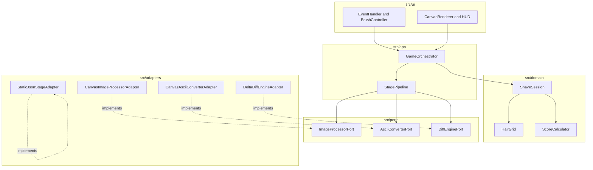

# 🪒 `shaving_him` 깃허브 공식 위키 (Official Wiki)

<div align="center">


**사진 1장으로 즐기는 브라우저 실시간 아스키(ASCII) 면도 게임**  
[🌐 라이브 웹 앱 플레이](https://clarusiubar.github.io/shaving_him/) • [📦 GitHub 저장소](https://github.com/ClarusIubar/shaving_him) • [📋 패치노트](Release-Patch-Notes)

</div>

---

## 📚 위키 내비게이션 (Wiki Navigation)

| 위키 문서 | 주요 설명 | 바로가기 |
| :--- | :--- | :---: |
| 📋 **공식 패치노트** | 버전별 패치 내역, 버그 수정 및 GitHub 이슈 링킹 | **[Release Patch Notes](Release-Patch-Notes)** |
| 📐 **구현된 아키텍처 의사결정 명세서** | 패턴 선택/배제 마트릭스, 모듈 책임 및 상호작용 통제 | **[Architecture Decision Matrix](Implemented-Architecture-Decision-Matrix)** |
| 🏛️ **아키텍처 명세서** | 5계층 모듈 구조, 시퀀스 흐름, 레이어 마트릭스 및 검증 게이트 | **[Architecture Specification](Architecture-Specification)** |
| ⚡ **성능 최적화 명세서** | 1D TypedArray, Dirty Region 부분 렌더링, GPU 합성 60 FPS 최적화 | **[Performance Architecture](Performance-Optimization-Architecture)** |

---

## 🌟 주요 시스템 특장점 (Key Features)

### 1. 🖼️ 1-Photo 브라우저 실시간 파이프라인
- 털 사진 1장(PNG, JPG, WEBP)만 업로드하면 **서버 없이 브라우저 단에서 1초 이내**에 피부 톤 동적 추출, 털 영역 감지, 아스키 아트 스테이지를 실시간 생성합니다.
- **알파 채널 예외 가드(a >= 128)**가 적용되어 투명 배경 PNG 이미지도 오작동 없이 처리됩니다.

### 2. 🏛️ 순수 5계층 클린 아키텍처 (Clean 5-Layer Modular Architecture)
- 게임 핵심 도메인(`HairGrid`, `ScoreCalculator`, `ShaveSession`)과 브라우저 DOM/Canvas API 간 **결합도 0%**를 유지하여 Node.js 환경에서 100% 독립 테스트가 가능합니다.

### 3. ⚡ 60 FPS 고성능 반응성 및 메모리 안전성
- **1D Uint8Array 평탄화**: $O(1)$ 고속 접근 및 0B 가비지 컬렉션(GC) 부하 차단.
- **Dirty Region 부분 렌더링**: 면도된 영역만 국소 추적 렌더링하여 프레임 타임 **< 1ms** 달성.
- **ObjectURL 자동 해제**: 이미지 변경 시 `URL.revokeObjectURL()`을 즉시 호출하여 브라우저 메모리 누수를 완전히 방지합니다.
- **UX 동기화**: 마우스 휠 리사이징 시 HUD 브러시 버튼 하이라이트가 동적으로 실시간 연동됩니다.

---

## 🏗️ 5계층 아키텍처 개요 (Layered Architecture Overview)



---

## 🧪 품질 및 자동화 테스트 현황 (Quality & Test Suite)

- **Node.js 내장 테스트 러너 통과율**: **100% (12 / 12 Cases PASS)**
- **테스트 커버리지**: 순수 도메인 모듈, 어댑터 변환기, 애플리케이션 오케스트레이터, UI 컨트롤러 콜백 전 영역 검증 완료.

```text
✔ StaticJsonStageAdapter - parses raw JSON into StageDataDTO
✔ DeltaDiffEngineAdapter - extracts dark hair positions
✔ CanvasAsciiConverterAdapter - maps color matrix to ASCII grid
✔ StagePipeline - computes dynamic average skin tone correctly
✔ StagePipeline - ignores transparent pixels (alpha < 128) in skin tone calculation
✔ StagePipeline - loads stage DTO cleanly
✔ GameOrchestrator - loadAndStartStage, shave, and callbacks
✔ BrushController - notifies onRadiusChange callback when setRadius is called
✔ GameOrchestrator - ignores shave() when session status is not RUNNING
✔ HairGrid - initializes and shaves correctly
✔ ScoreCalculator - calculates streak and bonuses
✔ ShaveSession - state transitions and timer ticks
```
