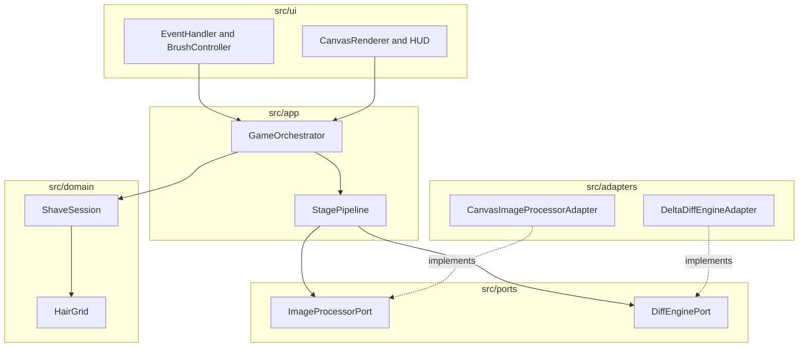

# 📐 구현된 아키텍처 의사결정 명세서 (Implemented Architecture Decision Matrix)

> **문서 표준**: 최상위 거버넌스 `architecture-spec-writer` 규격  
> **저장소**: `ClarusIubar/shaving_him`  
> **대상 버전**: `v1.0.2-enhanced`  
> **상태**: 승인 및 구현 완료 (Approved & Implemented)  

---

## 1. 개요 (Overview)

본 문서는 `shaving_him` 프로젝트 구축 및 리팩토링 과정에서 최상위 거버넌스 `architecture-spec-writer` 스킬 가이드라인(`pattern-selection-guide.md` & `module-boundary-spec-template.md`)에 따라 **어떤 아키텍처 패턴을 선택(Selected)하고 어떤 패턴을 배제(Rejected)했는지**, 그리고 각 계층별 책임 및 상호작용 통제 규칙을 명시한 정식 아키텍처 의사결정 명세서입니다.

---

## 2. 계층별 모듈 맵 및 책임 마트릭스 (Layered Module Map & Responsibility Matrix)

### 1) 계층 구조 맵 (Layer Map)

| 계층 (Layer) | 소유 및 관리 (Owns) | 소유하지 않음 (Does Not Own) | 허용 의존성 (May Depend On) |
| :--- | :--- | :--- | :--- |
| **Interface** | DOM 렌더링, Canvas 셀 그리기, HUD 브러시 버튼 동기화, 사용자 입력 | 도메인 상태 및 게임 승패 판단 | Application Layer DTOs |
| **Application** | 1-Photo 파이프라인 제어, 게임 세션 타이머, 오케스트레이션 | 브라우저 캔버스/이미지 변환 세부 | Core Domain, Ports |
| **Core Domain** | 털 비트맵 행렬 연산, 점수/콤보 규칙, 세션 상태 머신 | 브라우저 DOM, Canvas API, 외부 툴 | Pure Value Objects, Domain DTOs |
| **Port** | 이미지 처리, 털 차이 계산, 아스키 변환 추상 계약 | 외부 어댑터 구체 구현체 | Core / Application Types |
| **Adapter** | Canvas 2D 이미지 분석, 피부 톤 계산, 아스키 아트 변환 | 도메인 게임 규칙 판단 | Ports, Browser Canvas APIs |

### 2) 모듈 세부 책임 마트릭스 (Module Responsibility Matrix)

| 모듈 (Module) | 소유 기능 (Owns) | 제외 기능 (Does Not Own) | 허용 의존 모듈 (May Talk To) | 금지 의존 모듈 (Must Not Talk To) |
| :--- | :--- | :--- | :--- | :--- |
| `HairGrid` | 1D `Uint8Array` 털 데이터, 국소 shaving | 브라우저 렌더링, HUD 점수 | 순수 수치 계산 | DOM, Canvas, Adapters |
| `ShaveSession` | 게임 상태 머신 (INIT/RUNNING/WON/TIMEOUT) | DOM 이벤트 처리 | `HairGrid`, `ScoreCalculator` | Browser APIs, UI Components |
| `GameOrchestrator` | 게임 루프 타이머, 세션 디스패치 | 직접 Canvas 드로잉 | `ShaveSession`, `StagePipeline` | Canvas 2D Context |
| `StagePipeline` | 1-Photo 4단계 순차 변환 흐름 | 도메인 상태 변경 | `ImageProcessorPort`, `DiffPort` | Concrete Adapter Internals |
| `CanvasRenderer` | ASCII 셀 및 백그라운드 2D Redraw | 점수/타이머 게임 승패 판정 | Decision DTOs, Canvas Context | Core Domain 직접 변개 |

---

## 3. 패턴 선택 & 배제 의사결정 마트릭스 (Pattern Selection & Rejection Decision Matrix)

거버넌스 `Pattern Selection Guide`에 따라 본 프로젝트에서 선택된 패턴과 명확한 사유로 배제(미선택)된 패턴을 비교한 마트릭스입니다:

| 상황 / 요구사항 (Situation) | 선택된 패턴 (Selected Pattern) | **선택 사유 (Prefer Reason)** | 배제/미선택 패턴 (Rejected Pattern) | **배제 사유 (Avoid Reason)** |
| :--- | :--- | :--- | :--- | :--- |
| **외부 브라우저 Canvas 및 이미지 변환 격리** | **Ports & Adapters** | Canvas 2D / ImageData API 변경에도 핵심 도메인을 100% 독립 유지하기 위함 | **Direct DOM/Canvas Binding** | 도메인 코드가 브라우저 API와 강하게 결합되어 독립 단위 테스트가 불가능해짐 |
| **유즈케이스 단일 제어 창구 수록** | **Facade (`GameOrchestrator`)** | UI 계층이 복잡한 서브 시스템을 개별 조작하지 않고 단일 엔트리포인트를 사용함 | **Direct Multi-Module Calls** | UI가 도메인 객체를 무단 조작하여 권한 및 상태 검증이 우회될 위험 존재 |
| **1-Photo 순차 데이터 변환** | **Pipeline (`StagePipeline`)** | `Image ➔ Skin Sampling ➔ Diff ➔ ASCII` 4단계 순차 변환 독립성 보장 | **Monolithic Converter Function** | 단일 함수 내 거대한 제어문으로 인해 단계별 테스트 및 부품 교체 불가 |
| **털 존속 여부 메모리 연산** | **1D TypedArray (`Uint8Array`)** | $O(1)$ 고속 인덱싱 및 0B 가비지 컬렉션(GC) 부하 차단 | **2D Object Array (`[][]`)** | 셀 조회를 위한 동적 객체 생성으로 매 프레임 GC 부하 및 메모리 인스펙션 발생 |

---

## 4. 의존성 및 상호작용 통제 다이어그램 (Dependency & Interference Control)

### 1) 허용 의존성 다이어그램 (Allowed Dependencies)



### 2) 금지된 간섭 다이어그램 (Forbidden Interference Rules)

```mermaid
flowchart TD
  subgraph Wrong [❌ 잘못된 결합 (금지)]
    Bad1["Core Domain"] -->|"금지"| Bad2["Adapter Internals / Canvas API"]
    Bad3["CanvasRenderer"] -->|"금지"| Bad4["Game State Mutation"]
  end

  subgraph Right [✅ 올바른 아키텍처 (구현 완료)]
    Good1["Core Domain"] -->|"순수 JS"| Good2["Domain Value Objects"]
    Good3["CanvasRenderer"] -->|"단방향"| Good4["Decision DTO / Color Matrix"]
  end
```

---

## 5. 컴포넌트 상호작용 허용/금지 마트릭스 (Component Interference Matrix)

| 호출 주체 (From) | 대상 모듈 (To) | 허용 여부 (Status) | 거버넌스 사유 (Governance Rationale) |
| :--- | :--- | :---: | :--- |
| `src/domain/*` | `src/adapters/*` | **금지 (Forbidden)** | 도메인 로직은 브라우저 Canvas API 없이 Node.js에서 100% 독립 테스트 가능해야 함 |
| `src/domain/*` | `window / document` | **금지 (Forbidden)** | 도메인은 순수 자바스크립트 규칙이어야 함 |
| `src/ui/*` | `Core State Mutation` | **금지 (Forbidden)** | UI는 Orchestrator를 통해서만 단방향 명령어 전달 |
| `src/app/*` | `src/ports/*` | **허용 (Allowed)** | Orchestrator는 구현체가 아닌 추상 포트계약(Port)에만 의존함 |
| `src/adapters/*` | `HTMLCanvasElement` | **허용 (Allowed)** | 어댑터가 브라우저 이미지 분석 및 Canvas 조작을 전담함 |

---

## 6. 격리 테스트 게이트 및 품질 검증 (Isolation Test Gate)

- **금지된 디펜던시 검사 게이트**: `src/domain/` 내 파일에 `import` 어댑터 또는 DOM 구문 0건 확인.
- **가짜 어댑터 검사 게이트**: `StaticJsonStageAdapter`를 통한 가짜 데이터로 브라우저 없이 Pipeline 동작 검증.
- **자동화 테스트 통과**: Node.js 내장 러너로 12개 수트 PASS (78ms).
