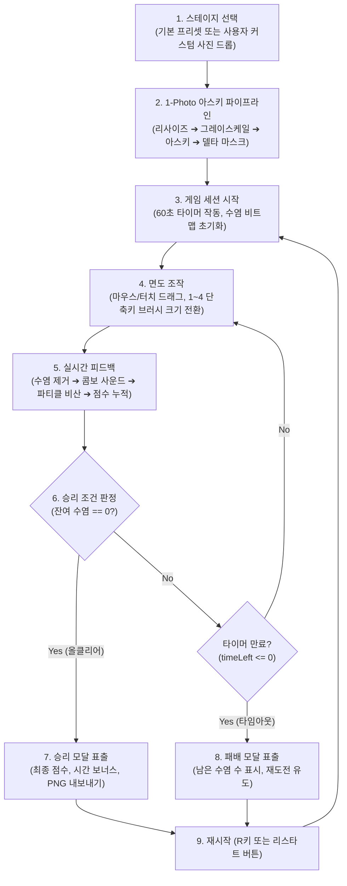

# 📋 [Game Requirement Specification] Shaving Him 기획서 - v1.14.0

> **위키 퀵 내비게이션**: [🏠 Wiki 홈](Home) | [🎮 라이브 게임 플레이](https://clarusiubar.github.io/shaving_him/) | [📋 기획서 (PRD)](기획서) | [📁 시스템 설계서](설계서) | [🏛️ ADR 명세서](ADR) | [📂 소스모듈 명세서](프로젝트_디렉토리_및_모듈_구조_명세서) | [⚡ 세부 기술 명세서](명세서) | [📊 수식/퍼징 검증서](스코어링_이론계산_실측값_검증) | [🧪 테스트 체계서](테스트_체계_및_TDD_명세서) | [📜 변경 이력](CHANGELOG)

---

## 📌 문서 목차 (Table of Contents)
1. [프로젝트 개요 (System Overview)](#1-프로젝트-개요-system-overview)
2. [시스템 요구사항 및 인터랙션 사양 (UX & Interactions)](#2-시스템-요구사항-및-인터랙션-사양-ux--interactions)
3. [코어 게임 루프 (Core Gameplay Loop)](#3-코어-게임-루프-core-gameplay-loop)
4. [1-Photo 아스키 변환 및 스테이지 시스템](#4-1-photo-아스키-변환-및-스테이지-시스템)
5. [면도 조작계 및 브러시 시스템 (Controls & Tools)](#5-면도-조작계-및-브러시-시스템-controls--tools)
6. [점수 산정 및 콤보 시스템 (Scoring & Combo Rules)](#6-점수-산정-및-콤보-시스템-scoring--combo-rules)
7. [종료 및 결과 처리 시스템 (Game Over & Export)](#7-종료-및-결과-처리-시스템-game-over--export)
8. [비기능 요구사항 및 기술 제약조건 (Technical Constraints)](#8-비기능-요구사항-및-기술-제약조건-technical-constraints)

---

## 1. 프로젝트 개요 (System Overview)

### 1.1. 시스템 개요
**Shaving Him (shaving_him)** 은 단일 이미지(1-Photo) 또는 JSON 프리셋 데이터를 입력받아 브라우저 메모리 상에서 아스키 아트 매트릭스를 생성하고, 포인터 입력(마우스/터치)에 따라 수염 비트맵을 갱신하는 2D 캔버스 기반 면도 시뮬레이션 게임 시스템입니다.

### 1.2. 시스템 핵심 설계 목표 (System Objectives)
1. **0B 런타임 에셋 의존성 (Zero Runtime Asset Load)**:
   - 외부 이미지 서버나 사전 녹음된 오디오 파일(`mp3`, `wav`) 네트워크 요청 없이, Canvas 2D 픽셀 파이프라인과 Web Audio API 절차적 합성으로만 시청각 피드백을 제공.
2. **절차적 오디오 피드백 사양**:
   - 면도 시 대역통과 필터 화이트 노이즈, 콤보 시 가변 피치 사인파, 승리 판정 시 4중 화음 사운드를 실시간 합성.
3. **60fps 반응성 및 렌더링 성능**:
   - 1D `Uint8Array` 기반 O(1) 비트맵 조회와 GPU 하드웨어 가속(`translate3d`)을 적용하여 60fps 렌더링 루프를 보장.

---

## 2. 시스템 요구사항 및 인터랙션 사양 (UX & Interactions)

- **타겟 환경**: 모던 웹 브라우저 (Chrome, Firefox, Safari, Edge) 데스크톱 및 모바일 환경.
- **인터랙션 피드백 사양**:
  - **시각적 피드백**: 수염 비트맵이 제거된 셀은 원본 피부 색상 및 아스키 문자로 복원되며, 제거된 위치에서 파티클이 비산됨.
  - **청각적 피드백**: 면도 조작 시 마찰음이 발생하며, 연속 면도 스트릭 증가에 따라 피치가 계단식으로 상승함.
  - **시간 제약**: 60초 카운트다운 게이지가 동작하며, 잔여 수염 개수와 진행률(%)이 실시간으로 HUD에 갱신됨.

---

## 3. 코어 게임 루프 (Core Gameplay Loop)

---

## 4. 1-Photo 아스키 변환 및 스테이지 시스템

### 4.1. 스테이지 입력 방식
1. **기본 프리셋 (Default Preset)**:
   - 번들된 `game_data.json` (또는 인라인 `window.EMBEDDED_GAME_DATA`)을 로드하여 실행.
2. **커스텀 사진 업로드 (Custom Photo Upload)**:
   - 파일 선택 또는 마우스 드래그 앤 드롭(Drag & Drop)으로 `JPG`, `PNG`, `WEBP` 이미지를 로드.

### 4.2. 4단계 인브라우저 생성 파이프라인
- **Stage 1 (Image Loading & Resizing)**: 브라우저 캔버스를 통해 이미지를 그리드 규격(280x219)으로 리사이즈.
- **Stage 2 (Grayscale & Luminance)**: 픽셀 데이터를 표준 휘도 가중치($Y = 0.299R + 0.587G + 0.114B$)로 변환.
- **Stage 3 (ASCII Conversion)**: 10단계 밀도 아스키 램프(` .:-=+*#%@`)를 통해 텍스트 매트릭스 생성.
- **Stage 4 (Delta Masking)**: 피부톤 임계값($Y > 120$)을 기준으로 피부 영역과 수염 좌표 리스트(`hairPositions`) 분리.

---

## 5. 면도 조작계 및 브러시 시스템 (Controls & Tools)

### 5.1. 마우스 및 터치 조작
- **마우스 드래그**: 캔버스 위에서 좌클릭 드래그 시 마우스 궤적을 브레젠험 알고리즘으로 연속 보간하여 수염 비트맵 갱신.
- **모바일 터치**: `touchstart` 및 `touchmove` 시 화면 스크롤을 방지하고 터치 포인트 좌표를 그리드 셀로 매핑.
- **마우스 휠**: 휠 스크롤 업/다운으로 브러시 크기(반경 1~7) 동적 변경.

### 5.2. 키보드 단축키
| 단축키 | 기능 | 상세 동작 |
| :---: | :--- | :--- |
| **`1`** | 초소형 브러시 (반경 1) | 국소 부위 면도용 (반경 1) |
| **`2`** | 소형 브러시 (반경 3) | 표준 면도용 (반경 3) |
| **`3`** | 중형 브러시 (반경 5) | 넓은 영역 면도용 (반경 5) |
| **`4`** | 대형 브러시 (반경 7) | 광범위 일괄 면도용 (반경 7) |
| **`R` / `r`** | 게임 재시작 (Restart) | 현재 스테이지 즉시 리셋 및 세션 재시작 |

---

## 6. 점수 산정 및 콤보 시스템 (Scoring & Combo Rules)

### 6.1. 기본 점수 및 콤보 가산 (`DefaultScoringStrategy`)
- 수염 면도 성공 시 스트릭($\text{streak}$)에 따라 배율($1\sim 5$)이 적용되어 점수가 가산됨:
  $$M(\text{streak}) = \min\left(\left\lfloor \frac{\text{streak}}{5} \right\rfloor + 1, 5\right)$$
  $$\Delta \text{Score} = \text{count} \times M(\text{streak})$$
- 수염이 없는 빈 셀을 면도하면 스트릭이 $0$으로 초기화됨.

### 6.2. 최종 점수 산정 공식
$$\text{Total Score} = \text{Base Score} + (\text{Time Left} \times 5) + \text{All-Clear Bonus (500)}$$

---

## 7. 종료 및 결과 처리 시스템 (Game Over & Export)

1. **승리 판정 (Victory)**:
   - 남은 수염 개수가 $0$이 되는 즉시 타이머가 정지하고, 승리 오디오 출력 및 최종 점수 오버레이가 표출됨.
2. **타임아웃 판정 (Defeat)**:
   - 60초 소진 시 조작이 잠금되고, 클리어 비율(%)과 잔여 수염 수가 표출됨.
3. **PNG 내보내기 (Export Canvas)**:
   - 면도 완료된 아스키 캔버스를 PNG 이미지 파일로 다운로드 지원.

---

## 8. 비기능 요구사항 및 기술 제약조건 (Technical Constraints)

1. **Pure Vanilla JavaScript (Zero Bundler/Framework)**:
   - Webpack, Vite, React 등의 번들러/프레임워크 종속성 없이 브라우저 Native ES Modules 환경에서 실행.
2. **0B External Assets (Zero HTTP Asset Requests)**:
   - 런타임 구동 중 외부 이미지, 폰트, 오디오 파일에 대한 네트워크 요청을 배제.
3. **Fail-Fast DOM Isolation**:
   - UI 뷰 및 입력 매니저는 필수 DOM 요소 누락 시 예외를 발생시켜(Fail-Fast) 결함을 조기 검출.
4. **100% RGR TDD & CI Quality Gate**:
   - 단위/통합/E2E 테스트 100% 통과, Line 100%, Function 100%, Branch 90%+ 품질 게이트 준수.
