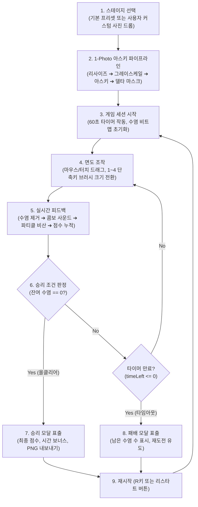

# 📋 [Game Requirement Specification] Shaving Him 기획서 - v1.13.0

> **위키 퀵 내비게이션**: [🏠 Wiki 홈](Home) | [🎮 라이브 게임 플레이](https://clarusiubar.github.io/shaving_him/) | [📋 기획서 (PRD)](기획서) | [📁 시스템 설계서](설계서) | [🏛️ ADR 명세서](ADR) | [📂 소스모듈 명세서](프로젝트_디렉토리_및_모듈_구조_명세서) | [⚡ 세부 기술 명세서](명세서) | [📊 수식/퍼징 검증서](스코어링_이론계산_실측값_검증) | [🧪 테스트 체계서](테스트_체계_및_TDD_명세서) | [📜 변경 이력](CHANGELOG)

---

## 📌 문서 목차 (Table of Contents)
1. [프로젝트 개요 및 비전 (Overview & Vision)](#1-프로젝트-개요-및-비전-overview--vision)
2. [타겟 사용자 및 플레이 경험 (Target & UX)](#2-타겟-사용자-및-플레이-경험-target--ux)
3. [코어 게임 루프 (Core Gameplay Loop)](#3-코어-게임-루프-core-gameplay-loop)
4. [1-Photo 아스키 변환 및 스테이지 시스템](#4-1-photo-아스키-변환-및-스테이지-시스템)
5. [면도 조작계 및 브러시 시스템 (Controls & Tools)](#5-면도-조작계-및-브러시-시스템-controls--tools)
6. [점수 산정 및 콤보 시스템 (Scoring & Combo Rules)](#6-점수-산정-및-콤보-시스템-scoring--combo-rules)
7. [종료 및 보상 시스템 (Victory, Defeat & Export)](#7-종료-및-보상-시스템-victory-defeat--export)
8. [비기능 요구사항 및 기술 제약조건 (Technical Constraints)](#8-비기능-요구사항-및-기술-제약조건-technical-constraints)

---

## 1. 프로젝트 개요 및 비전 (Overview & Vision)

### 1.1. 게임 컨셉
**Shaving Him (그 남자의 수염을 깎아라)** 은 복잡한 이미지 에셋이나 무거운 게임 엔진 없이, **단 1장의 얼굴 사진(1-Photo)** 또는 기본 프리셋 데이터로부터 고해상도 아스키 아트(ASCII Art) 캔버스를 실시간 생성하고, 사용자가 면도날(Razor)로 수염을 깎아내며 밑에 숨겨진 깨끗한 피부를 복원해 나가는 **레트로 아스키 아케이드 게임**입니다.

### 1.2. 핵심 가치 제안 (Core Value Propositions)
1. **0B 에셋 제로 로딩 (Zero Runtime Asset Load)**:
   - 외부 이미지 서버나 사운드 파일(`mp3`, `wav`)을 단 1바이트도 다운로드하지 않고, 브라우저 Canvas 2D 픽셀 파이프라인과 Web Audio API 절차적 합성만으로 경쾌한 시청각 피드백을 제공합니다.
2. **몰입감 넘치는 촉각적 오디오 피드백**:
   - 실시간 면도 시 Razor 마찰음(대역통과 화이트 노이즈), 연속 콤보 시 도레미파 음계 상승(사인파 가변 피치), 올클리어 승리 시 경쾌한 팡파레(트라이앵글 화음)를 동적으로 합성합니다.
3. **즉각적인 반응성과 60fps 부드러움**:
   - 1D `Uint8Array` 기반 O(1) 비트맵 조회와 GPU 하드웨어 가속(`translate3d`)을 결합하여, 마우스를 초고속으로 드래그해도 끊김 없는 60fps 렌더링을 보장합니다.

---

## 2. 타겟 사용자 및 플레이 경험 (Target & UX)

- **타겟 유저**: 직관적이고 경쾌한 타임어택 아케이드 퍼즐을 즐기는 게이머, 아스키 아트의 레트로 감성을 선호하는 개발자/테크 유저.
- **감성적 플레이 경험 (User Emotion)**:
  - **시각적 카타르시스**: 빽빽하게 얽혀 있던 수염 텍스트(`@`, `#`, `%`, `S`)가 마우스 궤적을 따라 시원하게 깎여 나가고 피부 톤이 드러나는 즉각적 보상.
  - **청각적 리듬감**: 연속해서 깎을 때마다 음계가 치솟는 콤보 차임벨 사운드로 콤보 유지 유도.
  - **시간 압박의 스릴**: 60초 제한시간 카운트다운 게이지가 줄어드는 가운데 마지막 잔여 수염 1가닥까지 찾아내는 몰입감.

---

## 3. 코어 게임 루프 (Core Gameplay Loop)

---

## 4. 1-Photo 아스키 변환 및 스테이지 시스템

### 4.1. 스테이지 입력 방식
1. **기본 프리셋 (Default Preset)**:
   - 번들된 `game_data.json` (또는 인라인 `window.EMBEDDED_GAME_DATA`)을 로드하여 즉시 시작.
2. **커스텀 사진 업로드 (Custom Photo Upload)**:
   - 파일 탐색기 선택 또는 마우스 드래그 앤 드롭(Drag & Drop)으로 `JPG`, `PNG`, `WEBP` 이미지를 주입.

### 4.2. 4단계 인브라우저 생성 파이프라인
- **Stage 1 (Image Loading & Resizing)**: 브라우저 캔버스를 통해 이미지를 그리드 규격(280x219)으로 리사이즈.
- **Stage 2 (Grayscale & Luminance)**: 픽셀 데이터를 표준 휘도 가중치($Y = 0.299R + 0.587G + 0.114B$)로 변환.
- **Stage 3 (ASCII Conversion)**: 10단계 밀도 아스키 램프(` .:-=+*#%@`)를 통해 텍스트 매트릭스 생성.
- **Stage 4 (Delta Masking)**: 피부톤 임계값($Y > 120$)을 기준으로 피부 영역과 수염 좌표 리스트(`hairPositions`) 분리.

---

## 5. 면도 조작계 및 브러시 시스템 (Controls & Tools)

### 5.1. 마우스 및 터치 조작
- **마우스 드래그**: 캔버스 위에서 좌클릭 드래그 시 마우스 궤적을 브레젠험 알고리즘으로 연속 보간하여 수염 제거.
- **모바일 터치**: `touchstart` 및 `touchmove` 시 화면 스크롤을 방지하고 터치 포인트 좌표를 그리드 셀로 매핑.
- **마우스 휠**: 휠 스크롤 업/다운으로 브러시 크기(반경 1~7) 동적 증감.

### 5.2. 키보드 단축키
| 단축키 | 기능 | 상세 동작 |
| :---: | :--- | :--- |
| **`1`** | 초소형 브러시 (반경 1) | 정밀한 국소 부위 및 잔여 1픽셀 정리용 |
| **`2`** | 소형 브러시 (반경 3) | 표준 면도용 |
| **`3`** | 중형 브러시 (반경 5) | 넓은 턱수염 영역 고속 정리용 |
| **`4`** | 대형 브러시 (반경 7) | 광범위 일괄 면도용 |
| **`R` / `r`** | 게임 재시작 (Restart) | 현재 스테이지 즉시 리셋 및 타이머 재가동 |

---

## 6. 점수 산정 및 콤보 시스템 (Scoring & Combo Rules)

### 6.1. 기본 점수 및 콤보 가산
- 수염 1회 면도 성공 시 기본 $10$점 획득.
- 연속해서 수염이 있는 셀을 면도할 때마다 **콤보 스트릭($k$)** 이 1씩 누적되며 콤보 승수 가산:
  $$\text{Score Increment} = 10 \times \min(k, 10)$$
- 수염이 없는 빈 셀을 헛깎으면 콤보 스트릭이 즉시 $0$으로 초기화됩니다.

### 6.2. 최종 점수 집계 공식
$$\text{Total Score} = \text{Base Score} + (\text{Time Left} \times 20) + \text{All-Clear Bonus (1000)}$$

---

## 7. 종료 및 보상 시스템 (Victory, Defeat & Export)

1. **승리 판정 (Victory)**:
   - 남은 수염 개수가 $0$이 되는 순간 타이머가 정지하고, 승리 팡파레 사운드와 함께 최종 점수 오버레이 표출.
2. **타임아웃 판정 (Defeat)**:
   - 60초가 모두 소진되면 면도가 잠금되고, 클리어 비율(%)과 잔여 수염 수가 표출되며 재도전 유도.
3. **PNG 내보내기 (Export Canvas)**:
   - 면도 완료된 아스키 캔버스를 고해상도 PNG 이미지 파일로 다운로드하여 소장 및 공유 지원.

---

## 8. 비기능 요구사항 및 기술 제약조건 (Technical Constraints)

1. **Pure Vanilla JavaScript (Zero Bundler/Framework)**:
   - Webpack, Vite, React 등의 런타임 종속성 없이 브라우저 Native ES Modules 환경에서 단독 실행.
2. **0B External Assets (Zero HTTP Asset Requests)**:
   - 게임 구동 중 외부 이미지, 폰트, 오디오 파일에 대한 네트워크 요청을 일체 금지.
3. **Fail-Fast DOM Isolation**:
   - UI 뷰 및 입력 매니저는 필수 DOM 요소 누락 시 즉시 예외를 발생시켜(Fail-Fast) 무결성을 보증.
4. **100% RGR TDD & CI Quality Gate**:
   - 단위/통합/E2E 테스트 100% 통과, Line 100%, Function 100%, Branch 98%+ 품질 게이트 필수 준수.
