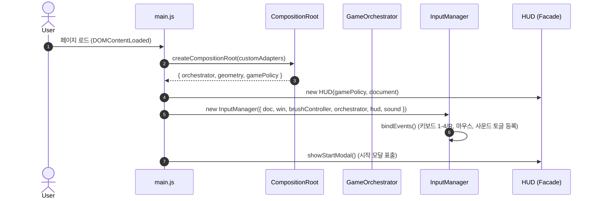
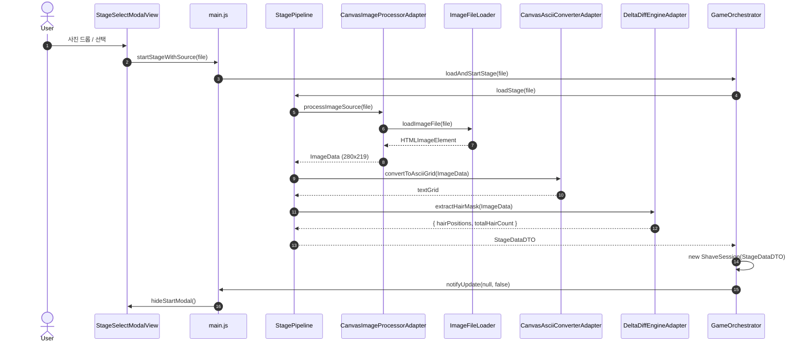
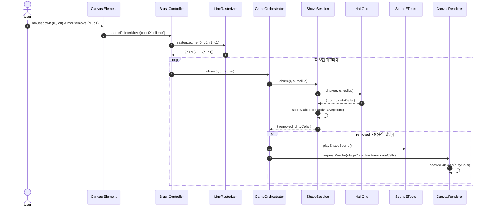
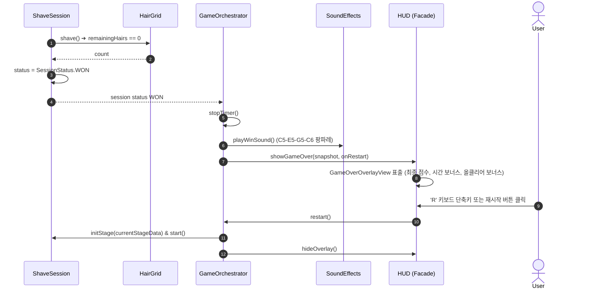

# 📁 [System Architecture & Design] Shaving Him 설계서 - v1.13.0

> **위키 퀵 내비게이션**: [🏠 Wiki 홈](Home) | [📋 기획서 (PRD)](기획서) | [📁 시스템 설계서](설계서) | [🏛️ ADR 명세서](ADR) | [📂 소스모듈 명세서](프로젝트_디렉토리_및_모듈_구조_명세서) | [⚡ 세부 기술 명세서](명세서) | [📊 수식/퍼징 검증서](스코어링_이론계산_실측값_검증) | [🧪 테스트 체계서](테스트_체계_및_TDD_명세서) | [📜 변경 이력](CHANGELOG)

---

## 📌 문서 목차 (Table of Contents)
1. [전체 시스템 아키텍처 개요 (System Architecture Overview)](#1-전체-시스템-아키텍처-개요-system-architecture-overview)
2. [SOLID 5대 원칙 완수 체계 (SOLID Principles Enforcement)](#2-solid-5대-원칙-완수-체계-solid-principles-enforcement)
3. [거시적 시스템 아키텍처 조감도 (Macro System Blueprint)](#3-거시적-시스템-아키텍처-조감도-macro-system-blueprint)
4. [5계층별 세부 아키텍처 설계 (5-Layer Architectural Design)](#4-5계층별-세부-아키텍처-설계-5-layer-architectural-design)
   - [4.1. Domain Core Layer (순수 비즈니스 로직)](#41-domain-core-layer-순수-비즈니스-로직)
   - [4.2. Ports Layer (DIP 추상 계약)](#42-ports-layer-dip-추상-계약)
   - [4.3. Application Layer (유스케이스 오케스트레이션)](#43-application-layer-유스케이스-오케스트레이션)
   - [4.4. Adapters Layer (인프라 & 캔버스 구현체)](#44-adapters-layer-인프라--캔버스-구현체)
   - [4.5. Interface UI Layer (수동적 뷰 & 입력 제어기)](#45-interface-ui-layer-수동적-뷰--입력-제어기)
5. [데이터 수명주기 및 상호작용 시퀀스 다이어그램 (Sequence Diagrams)](#5-데이터-수명주기-및-상호작용-시퀀스-다이어그램-sequence-diagrams)
   - [5.1. 앱 부트스트랩 및 DI 주입 시퀀스](#51-앱-부트스트랩-및-di-주입-시퀀스)
   - [5.2. 1-Photo 아스키 파이프라인 생성 시퀀스](#52-1-photo-아스키-파이프라인-생성-시퀀스)
   - [5.3. 마우스 드래그 면도 및 실시간 사운드/파티클 피드백 시퀀스](#53-마우스-드래그-면도-및-실시간-사운드파티클-피드백-시퀀스)
   - [5.4. 올클리어 승리 및 리스타트 시퀀스](#54-올클리어-승리-및-리스타트-시퀀스)

---

## 1. 전체 시스템 아키텍처 개요 (System Architecture Overview)

본 시스템은 도메인 모델이 브라우저 DOM API나 특정 UI 렌더러에 종속되지 않도록 **5계층 클린 아키텍처(5-Layer Clean Architecture & Hexagonal Ports/Adapters)** 패턴을 엄격히 준수합니다.

```text
[UI Presentation Layer] (InputManager, CanvasRenderer, HUD, Views, SoundEffects)
          │
          ▼
[Application Layer]     (CompositionRoot, GameOrchestrator, StagePipeline)
     │          │
     ▼          ▼
[Domain Core] [Abstract Ports] ◄────── [Secondary Adapters]
(HairGrid,     (StageSource,           (CanvasImageProcessor,
 ShaveSession,  ImageProcessor,         CanvasAsciiConverter,
 ScoreCalc,     AsciiConverter,         DeltaDiffEngine,
 LineRaster)    DiffEngine)             ImageFileLoader)
```

- **의존성 역전 원칙(DIP)**: 상위 계층(App)은 하위 구현체(Adapters)를 직접 import하지 않으며, 오직 `ports/`에 정의된 추상 인터페이스 계약에만 의존합니다.
- **Composition Root**: `src/app/composition-root.js`가 단일 진입점에서 모든 어댑터와 도메인/앱 인스턴스를 생성하고 생성자 주입(Constructor Injection)을 통해 결합합니다.

---

## 2. SOLID 5대 원칙 완수 체계 (SOLID Principles Enforcement)

| 원칙 | 구현 및 설계 사양 | 적용 모듈 |
| :--- | :--- | :--- |
| **SRP (단일 책임)** | `main.js`의 DOM/키보드 바인딩을 `InputManager`로 분리하고, 이미지 비동기 로딩을 `ImageFileLoader`로 캡슐화 | `InputManager`, `ImageFileLoader`, `HUD` |
| **OCP (개방-폐쇄)** | `StageSourceRegistry` 핸들러 맵을 통해 새로운 스테이지 형식(예: SVG, 비디오 스트림) 추가 시 기존 파이프라인 무수정 확장 | `StageSourceHandlers`, `StagePipeline` |
| **LSP (리스코프 치환)** | 모든 4대 어댑터는 부모 Port의 메서드 시그니처와 에러 계약을 100% 충족하며 다형적으로 치환 가능 | `src/adapters/*` ➔ `src/ports/*` |
| **ISP (인터페이스 분리)** | 수염 비트맵 조회용 `toReadOnlyView()`를 분리하여 UI가 불필요한 `shave()` 변개 권한을 갖지 못하도록 차단 | `HairGrid.toReadOnlyView`, `types/index.d.ts` |
| **DIP (의존성 역전)** | `StagePipeline`과 `CanvasRenderer`는 구체 클래스를 직접 `new`하지 않고 인터페이스 및 DI 주입 지원 | `CompositionRoot`, `CanvasRenderer` |

---

## 3. 거시적 시스템 아키텍처 조감도 (Macro System Blueprint)

```mermaid
flowchart TD
  subgraph UILayer ["5. Interface & Presentation Layer (src/ui)"]
    Input["InputManager (DOM/Keyboard 분리)"]
    Brush["BrushController (GPU translate3d)"]
    Renderer["CanvasRenderer (DI 주입)"]
    Particle["ParticleSystem"]
    Sound["SoundEffects (100% Web Audio)"]
    HUD["HUD (UI Facade)"]
    Views["Stats / Modal / Loading / GameOver Views"]
  end

  subgraph AppLayer ["3. Application Layer (src/app)"]
    CompRoot["Composition Root"]
    Orchestrator["GameOrchestrator (상태 머신)"]
    Pipeline["StagePipeline (4단계 생성 파이프라인)"]
    Handlers["StageSourceHandlers (OCP 레지스트리)"]
  end

  subgraph PortsLayer ["2. Abstract Ports Layer (src/ports)"]
    StagePort["StageSourcePort"]
    ImagePort["ImageProcessorPort"]
    AsciiPort["AsciiConverterPort"]
    DiffPort["DiffEnginePort"]
  end

  subgraph DomainLayer ["1. Pure Domain Core (src/domain)"]
    Session["ShaveSession"]
    Grid["HairGrid (1D Uint8Array 0B)"]
    Score["ScoreCalculator (콤보 & 보너스)"]
    Geom["GridGeometry (Value Object)"]
    Raster["LineRasterizer (Bresenham)"]
    Validator["SchemaValidator (런타임 무결성)"]
    Policy["GamePolicy (승리 판정)"]
  end

  subgraph AdaptersLayer ["4. Secondary Driven Adapters (src/adapters)"]
    JsonAdap["StaticJsonStageAdapter"]
    ImgAdap["CanvasImageProcessorAdapter"]
    FileLoader["ImageFileLoader (비동기 디코딩)"]
    AsciiAdap["CanvasAsciiConverterAdapter"]
    DiffAdap["DeltaDiffEngineAdapter"]
  end

  Input --> Orchestrator
  Input --> Brush
  Input --> HUD
  Input --> Sound
  HUD --> Views
  Renderer --> Particle
  Brush --> Raster
  
  CompRoot --> Orchestrator
  CompRoot --> Pipeline
  CompRoot --> Geom
  CompRoot --> Policy
  
  Orchestrator --> Session
  Session --> Grid
  Session --> Score
  Session --> Validator
  
  Pipeline --> Handlers
  Handlers --> StagePort
  Pipeline --> ImagePort
  Pipeline --> AsciiPort
  Pipeline --> DiffPort
  
  ImgAdap -.-> ImagePort
  ImgAdap --> FileLoader
  AsciiAdap -.-> AsciiPort
  DiffAdap -.-> DiffPort
  JsonAdap -.-> StagePort
```



---

## 4. 5계층별 세부 아키텍처 설계 (5-Layer Architectural Design)

### 4.1. Domain Core Layer (`src/domain/`)
- **`HairGrid`**: 1D `Uint8Array` 기반의 비트맵 매트릭스로, $r \times \text{cols} + c$ 단일 인덱스를 통해 O(1) 비트 조회/반전을 수행하며 가비지 컬렉션(GC) 할당을 발생시키지 않습니다.
- **`ShaveSession`**: `INIT`, `RUNNING`, `PAUSED`, `WON`, `TIMEOUT` 5대 세션 상태 머신을 통제하고 타이머 틱 및 스냅샷 조회를 관장합니다.
- **`ScoreCalculator`**: 연속 콤보 스트릭($k$)에 따른 누적 점수($10 \times \min(k, 10)$), 잔여 시간 보너스, 올클리어 보너스를 계산합니다.
- **`GridGeometry`**: 불변(Immutable) 값 객체로 캔버스 뷰포트 $x, y$ 좌표를 안전하게 그리드 셀 $(r, c)$로 변환하는 정규화 매핑을 전담합니다.
- **`LineRasterizer`**: 초고속 마우스 드래그 시 발생하는 좌표 간격을 브레젠험 8-연결 알고리즘으로 보간하여 끊김 없는 면도를 보장합니다.
- **`SchemaValidator`**: `validateStageData` 및 `validateSnapshot`을 통해 DTO 런타임 데이터 구조를 방어합니다.

### 4.2. Ports Layer (`src/ports/`)
- **`StageSourcePort`**: `loadStage(source, targetCols, targetRows, options, onProgress)` 추상 계약.
- **`ImageProcessorPort`**: `processImageSource(source, targetWidth, targetHeight)` 추상 계약.
- **`AsciiConverterPort`**: `convertToAsciiGrid(imageData, targetCols, targetRows)` 추상 계약.
- **`DiffEnginePort`**: `extractHairMask(imageData, targetCols, targetRows, skinLumThreshold)` 추상 계약.

### 4.3. Application Layer (`src/app/`)
- **`CompositionRoot`**: 어댑터와 도메인 객체를 생성자 주입 방식으로 배선하여 결합도를 역전시키는 조립 루트.
- **`GameOrchestrator`**: `setInterval` 1초 클록을 관리하며, 상태 변경 시 단일 DTO 이벤트(`snapshot`, `stageData`, `hairView`, `dirtyCells`)를 UI로 통지.
- **`StagePipeline`**: 이미지 리사이징 ➔ 그레이스케일 ➔ 아스키 텍스트 ➔ 델타 마스킹의 4단계를 프로그레스 콜백과 함께 수행.

### 4.4. Adapters Layer (`src/adapters/`)
- **`CanvasImageProcessorAdapter`**: 브라우저 캔버스를 사용하여 `HTMLImageElement` 또는 `File`을 리사이징하고 픽셀 데이터 추출. 비동기 파일 처리는 `ImageFileLoader`로 위임.
- **`CanvasAsciiConverterAdapter`**: 픽셀 휘도 값을 10단계 문자 램프에 매핑하여 아스키 매트릭스 생성.
- **`DeltaDiffEngineAdapter`**: 피부톤 휘도 임계값을 초과하는 어두운 수염 픽셀을 검출하여 수염 비트맵 좌표 분리.
- **`StaticJsonStageAdapter`**: JSON 정적 데이터 로드 및 브라우저 로컬 `window.EMBEDDED_GAME_DATA` 폴백 지원.

### 4.5. Interface UI Layer (`src/ui/`)
- **`InputManager`**: 키보드 단축키(`1~4`, `R`), 마우스/터치 브러시 버튼, 사운드 토글, 모달 창 이벤트 등록 및 `destroy()` 정리 전담.
- **`BrushController`**: 캔버스 포인터 이벤트 수신, 브러시 반경 클램핑, GPU 하드웨어 가속(`translate3d`) 커서 애니메이션 처리.
- **`CanvasRenderer`**: Dirty Cell 기반 부분 다시 그리기 및 `ParticleSystem` 비산 파티클 배치 렌더링.
- **`SoundEffects`**: Web Audio API 기반 100% 절차적 오디오 합성 엔진.

---

## 5. 데이터 수명주기 및 상호작용 시퀀스 다이어그램 (Sequence Diagrams)

### 5.1. 앱 부트스트랩 및 DI 주입 시퀀스


### 5.2. 1-Photo 아스키 파이프라인 생성 시퀀스


### 5.3. 마우스 드래그 면도 및 실시간 사운드/파티클 피드백 시퀀스


### 5.4. 올클리어 승리 및 리스타트 시퀀스

