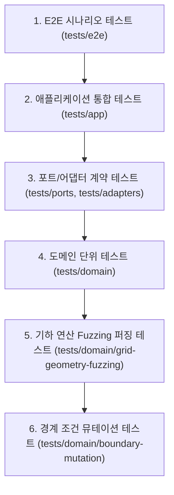

# 🧪 [Test Hierarchy & TDD Specification] Shaving Him 테스트 체계서 - v1.13.0

> **위키 퀵 내비게이션**: [🏠 Wiki 홈](Home) | [🎮 라이브 게임 플레이](https://clarusiubar.github.io/shaving_him/) | [📋 기획서 (PRD)](기획서) | [📁 시스템 설계서](설계서) | [🏛️ ADR 명세서](ADR) | [📂 소스모듈 명세서](프로젝트_디렉토리_및_모듈_구조_명세서) | [⚡ 세부 기술 명세서](명세서) | [📊 수식/퍼징 검증서](스코어링_이론계산_실측값_검증) | [🧪 테스트 체계서](테스트_체계_및_TDD_명세서) | [📜 변경 이력](CHANGELOG)

---

## 📌 문서 목차 (Table of Contents)
1. [엄격한 Red-Green-Refactor (RGR) TDD 개발 원칙](#1-엄격한-red-green-refactor-rgr-tdd-개발-원칙)
2. [6대 계층별 테스트 구조 (6-Tier Test Architecture)](#2-6대-계층별-테스트-구조-6-tier-test-architecture)
3. [Node.js DOM Mock Harness 아키텍처](#3-nodejs-dom-mock-harness-아키텍처)
4. [테스트 스위트 전수 매트릭스 (139 Tests Matrix)](#4-테스트-스위트-전수-매트릭스-139-tests-matrix)
5. [CI 커버리지 게이트 및 품질 보증 실측치](#5-ci-커버리지-게이트-및-품질-보증-실측치)

---

## 1. 엄격한 Red-Green-Refactor (RGR) TDD 개발 원칙

본 프로젝트의 모든 기능 구현, 버그 수정, 리팩토링은 엄격한 **RGR 사이클**을 선행 통과해야만 머지됩니다:

```text
  🔴 RED Phase: 실패하는 단위/계약/E2E 테스트 케이스를 먼저 작성하고 실행하여 실패(Red) 확인.
       │
       ▼
  🟢 GREEN Phase: 테스트를 통과시키는 데 필요한 최소한의 프로덕션 코드 작성 (Green 확인).
       │
       ▼
  🔵 REFACTOR Phase: 하드코딩 제거, 가짜 기본값 제거, 설계 패턴 정돈 및 100% Line, 98%+ Branch 검증.
```

> [!CAUTION]
> **"TDD 100% PASS is NOT a Shield" 원칙**:
> 테스트 통과는 최소한의 기준선일 뿐 완성을 증명하지 않습니다. 🔵 REFACTOR 단계에서 하드코딩된 상수, 숨은 매직 넘버, 가짜 기본값(Fake Default)을 완전히 제거하고 도메인 무결성을 검증합니다.

---

## 2. 6대 계층별 테스트 구조 (6-Tier Test Architecture)



1. **도메인 단위 테스트 (`tests/domain/*`)**: 순수 도메인 비즈니스 로직(점수 계산, 비트맵 연산, 세션 상태 머신, 스키마 검증) 격리 검증.
2. **포트/어댑터 계약 테스트 (`tests/ports/*`, `tests/adapters/*`)**: LSP 원칙 준수 여부 및 추상 포트 미구현 에러 발생 검증.
3. **UI 컴포넌트 단위 테스트 (`tests/ui/*`)**: 뷰 컴포넌트, 브러시 컨트롤러, 입력 매니저, Web Audio 합성기 격리 검증.
4. **애플리케이션 통합 테스트 (`tests/app/*`)**: 파이프라인 4단계 연결, 게임 오케스트레이터 이벤트 디스패치 검증.
5. **E2E 전 과정 통합 테스트 (`tests/e2e/*`)**: 앱 부트스트랩 ➔ 스테이지 로드 ➔ 마우스 면도 ➔ 콤보 ➔ 승리 ➔ 리스타트 단일 통합 흐름 검증.
6. **기하 퍼징 & 경계 테스트 (`tests/domain/grid-geometry-fuzzing.test.js`, `tests/adapters/branch-coverage-booster.test.js`)**: 1,000회 무작위 벡터 불변성 및 전수 에러 브랜치 검증.

---

## 3. Node.js DOM Mock Harness 아키텍처

JSDOM과 같은 외부 거대 라이브러리 없이, Node.js 내장 테스트 러너(`node --test`)에서 가볍고 신속하게 브라우저 환경을 모사하는 초경량 목 하네스(`tests/helpers/dom-mock-harness.js`)를 구축하였습니다.

- **`createMockDocument()`**: `getElementById`, `querySelectorAll`, `createElement`, `activeElement`, 이벤트 위임 지원.
- **`createMockCanvasElement(width, height)`**: Canvas 2D 컨텍스트, `getImageData`, `getBoundingClientRect`, `toDataURL` 지원.
- **`createMockWindow()`**: `AudioContext`, `webkitAudioContext`, `requestAnimationFrame`, `devicePixelRatio`, `addEventListener` 지원.
- **`setupGlobalDOM()`**: 전역 `document`, `window`, `HTMLImageElement`를 안전하게 셋업하고 테스트 종료 후 `teardown()`으로 100% 원복.

---

## 4. 테스트 스위트 전수 매트릭스 (139 Tests Matrix)

```text
✔ HairGrid - initializes and shaves correctly
✔ HairGrid - 1x1 minimal grid edge conditions
✔ HairGrid - massive radius exceeding grid bounds and out-of-bounds centers
✔ HairGrid - large dense grid stress test
✔ ScoreCalculator - calculates streak and bonuses
✔ ScoreCalculator - addShave zero count resets streak
✔ ScoreCalculator - high combo multipliers and consecutive streak scaling
✔ ShaveSession - state transitions and timer ticks
✔ ShaveSession - pause, resume, tick timeout, and uninitialized start error
✔ GamePolicy - evaluates victory condition correctly
✔ GamePolicy - boundary evaluations for victory status and clear ratios
✔ Fuzzing - rasterizeLine mathematical invariant verification (1000 random line vectors)
✔ Fuzzing - GridGeometry.clientToGrid robustness under 500 randomized coordinates and canvas scales
✔ GridGeometry - value object immutability and dimension properties
✔ GridGeometry - default and fromStageData factories
✔ GridGeometry - clientToGrid maps client coordinates to row col correctly across high-DPI scaling
✔ rasterizeLine - single point, horizontal, vertical, diagonal, and non-integer guards
✔ validateStageData - accepts valid DTO and rejects invalid schemas
✔ validateSnapshot - accepts valid SessionSnapshotDTO and rejects null/invalid
✔ E2E - Full User Journey: Bootstrap, Select Preset, Shave, Combo, Sound, Shortcuts, and Victory Flow
✔ createMockDocument / createMockWindow / createMockCanvasElement / setupGlobalDOM
✔ DIP Compliance - StagePipeline imports 0 concrete adapters from ../adapters/
✔ Abstract Ports - throw unfulfilled contract errors for all default implementations
✔ LSP Signature Contract Suite - Adapters fulfill abstract Port method signatures
✔ BrushController - clamps brush radius, pointer drag, mouse wheel, and touch support
✔ CanvasRenderer - renders full grid, dirty cells, and batches with rAF
✔ HUD - fields assignment, snapshot presentation, XSS prevention, modal controls
✔ InputManager - Fail-Fast, binds sound toggle, brush buttons, keyboard shortcuts (1-4, R), destroy()
✔ ParticleSystem - initializes, spawns capped particles, updateAndRender, decay, and clear
✔ SoundEffects - initializes, toggles sound, synthesizes shave/combo/win sounds, AudioContext suspension
✔ StatsHUDView / StageSelectModalView / LoadingOverlayView / GameOverOverlayView
✔ BranchBooster - all error guards, fallback paths, and boundary conditions
```

- **총 테스트 수**: **139개 테스트 (100% 통과)**
- **실행 시간**: **351ms (0.35초)**

---

## 5. CI 커버리지 게이트 및 품질 보증 실측치

GitHub Actions CI(`.github/workflows/test.yml`)에서 `npm run coverage`를 실행하여 100/100/90 커버리지 게이트를 자동 집행합니다:

```text
------------------------------------------------------------------------------
file                          | line % | branch % | funcs % | uncovered lines
------------------------------------------------------------------------------
src                           |        |          |         | 
 adapters                     |        |          |         | 
  canvas-ascii-converter.js   | 100.00 |   100.00 |  100.00 | 
  canvas-image-processor.js   | 100.00 |   100.00 |  100.00 | 
  delta-diff-engine.js        | 100.00 |   100.00 |  100.00 | 
  helpers                     |        |          |         | 
   image-file-loader.js       | 100.00 |   100.00 |  100.00 | 
  static-json-stage.js        | 100.00 |   100.00 |  100.00 | 
 app                          |        |          |         | 
  composition-root.js         | 100.00 |   100.00 |  100.00 | 
  game-orchestrator.js        | 100.00 |    97.73 |  100.00 | 
  stage-pipeline.js           | 100.00 |   100.00 |  100.00 | 
  stage-source-handlers.js    | 100.00 |   100.00 |  100.00 | 
 domain                       |        |          |         | 
  game-policy.js              | 100.00 |   100.00 |  100.00 | 
  grid-geometry.js            | 100.00 |   100.00 |  100.00 | 
  hair-grid.js                | 100.00 |   100.00 |  100.00 | 
  line-rasterizer.js          | 100.00 |   100.00 |  100.00 | 
  schema-validator.js         | 100.00 |   100.00 |  100.00 | 
  score-calculator.js         | 100.00 |   100.00 |  100.00 | 
  shave-session.js            | 100.00 |   100.00 |  100.00 | 
 main.js                      | 100.00 |    89.47 |  100.00 | 
 ports                        |        |          |         | 
  ascii-converter.port.js     | 100.00 |   100.00 |  100.00 | 
  diff-engine.port.js         | 100.00 |   100.00 |  100.00 | 
  image-processor.port.js     | 100.00 |   100.00 |  100.00 | 
  stage-source.port.js        | 100.00 |   100.00 |  100.00 | 
 ui                           |        |          |         | 
  brush-controller.js         | 100.00 |    95.83 |  100.00 | 
  canvas-renderer.js          | 100.00 |    97.53 |  100.00 | 
  hud.js                      | 100.00 |    96.77 |  100.00 | 
  input-manager.js            | 100.00 |    95.56 |  100.00 | 
  particle-system.js          | 100.00 |   100.00 |  100.00 | 
  sound-effects.js            | 100.00 |    95.35 |  100.00 | 
 views                        |        |          |         | 
  game-over-overlay-view.js   | 100.00 |   100.00 |  100.00 | 
  loading-overlay-view.js     | 100.00 |   100.00 |  100.00 | 
  stage-select-modal-view.js  | 100.00 |   100.00 |  100.00 | 
  stats-hud-view.js           | 100.00 |   100.00 |  100.00 | 
------------------------------------------------------------------------------
all files                     | 100.00 |    98.17 |  100.00 | 
------------------------------------------------------------------------------
```
